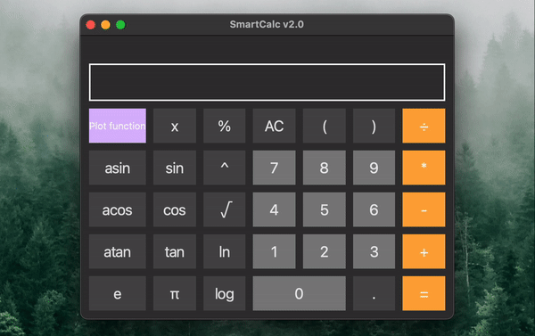

# SmartCalc v2.0

## Installation
      make install

## Uninstallation
      make uninstall

## Introduction

This project implements an enhanced version of the standard C++ calculator using the MVC pattern. In addition to basic arithmetic operations such as addition/subtraction and multiplication/division, the calculator adds the ability to calculate arithmetic expressions in order, as well as some mathematical functions (sine, cosine, logarithm, etc.). Besides evaluating expressions, it also supports using the _x_ variable and plotting the corresponding function.

### MVC pattern

The Model-View-Controller (MVC) pattern is a scheme of separating application modules into three macro-components: a model that contains the business logic, a view that is a UI form to interact with the program, and a controller that modifies the model by user action.

The concept of MVC was introduced by Trygve Reenskaug in 1978, who was working on the Smalltalk programming language at Xerox PARC. Later, Steve Burbeck implemented the pattern in Smalltalk-80.
The final version of the MVC concept was published in the journal Technology Object in 1988. The MVC pattern subsequently evolved, giving rise to variants such as HMVC, MVA, MVVM.

The main need for this pattern stems from the developers' desire to separate the business logic of the program from the views, which makes it easy to replace views and to reuse logic that has been implemented once in other environments. A model separated from the view and a controller to interact with it allows you to reuse or modify already written code more efficiently.

The model stores and accesses the main data, performs operations on requests, defined by the business logic of the program that means it is in charge of the part of the program responsible for all algorithms and information processing. These models, modified by the controller, affect the information display on the user interface. The model in this program should be the class library that performs the calculations. This library must provide all the necessary classes and methods to perform them. And this is the business logic of the program, because it provides the means to solve the problem.

A controller is a thin macro component that performs model modifications. It is used to generate requests for it. In code, it looks like a kind of "facade" for the model that means a set of methods that already work directly with the model. It is called thin because the ideal controller contains no additional logic other than calling one or more methods of the model. The controller serves as a link between the interface and the model. This allows the model to be fully encapsulated from the display. This separation is helpful in that it allows the view code to know nothing about the model code and to address only the controller, whose interface of the provided functions will probably be not changed much. The model, on the other hand, can undergo significant changes, and if you "move" to other algorithms, technologies, or even programming languages in the model, only a small section of code in the controller directly related to the model will need to be changed. Otherwise, it would probably be necessary to rewrite a significant part of the interface code, as it would depend a lot on the implementation of the model. So, when interacting with the interface, the user calls controller methods that modify the model.

The view includes all code associated with the program interface. An ideal interface code should not contain any business logic. It only represents the form for interaction with the user.

## Implementation of SmartCalc v2.0

You need to implement the SmartCalc v2.0:

- The program must be developed in C++ language of C++17 standard
- The program code must be located in the src folder
- When writing code it is necessary to follow the Google style
- Classes must be implemented within the namespace
- Prepare full coverage of expression calculation modules with unit-tests using the GTest library
- The program must be built with Makefile which contains standard set of targets for GNU-programs: all, install, uninstall, clean, dvi, dist, tests. Installation directory could be arbitrary
- GUI implementation, based on any GUI library with API for C++17: Qt
- The program must be implemented using the MVC pattern, and also:
   - there should be no business logic code in the view code
   - there should be no interface code in the controller and the model
   - controllers must be thin
- Both integers and real numbers with a dot can be input into the program.
- The calculation must be done after you complete entering the calculating expression and press the `=` symbol.
- Calculating arbitrary bracketed arithmetic expressions in infix notation
- Calculate arbitrary bracketed arithmetic expressions in infix notation with substitution of the value of the variable _x_ as a number
- Plotting a graph of a function given by an expression in infix notation with the variable _x_ (with coordinate axes, mark of the used scale and an adaptive grid)
   - It is not necessary to provide the user with the ability to change the scale
- Domain and codomain of a function are limited to at least numbers from -1000000 to 1000000
   - To plot a graph of a function it is necessary to additionally specify the displayed domain and codomain
- Verifiable accuracy of the fractional part is at least to 7 decimal places
- Users must be able to enter up to 255 characters
- Bracketed arithmetic expressions in infix notation must support the following arithmetic operations and mathematical functions:
   - **Arithmetic operators**:
     | Operator name | Infix notation   (Classic) | Prefix notation   (Polish notation) |  Postfix notation   (Reverse Polish notation) |
      | --------- | ------ | ------ | ------ |
      | Brackets | (a + b) | (+ a b) | a b + |
      | Addition | a + b | + a b | a b + |
      | Subtraction | a - b | - a b | a b - |
      | Multiplication | a * b | * a b | a b * |
      | Division | a / b | / a b | a b \ |
      | Power | a ^ b | ^ a b | a b ^ |
      | Modulus | a mod b | mod a b | a b mod |
      | Unary plus | +a | +a | a+ |
      | Unary minus | -a | -a | a- |

   - **Functions**:
      | Function description | Function |
      | ------ | ------ |
      | Computes cosine | cos(x) |
      | Computes sine | sin(x) |
      | Computes tangent | tan(x) |
      | Computes arc cosine | acos(x) |
      | Computes arc sine | asin(x) |
      | Computes arc tangent | atan(x) |
      | Computes square root | sqrt(x) |
      | Computes natural logarithm | ln(x) |
      | Computes common logarithm | log(x) |